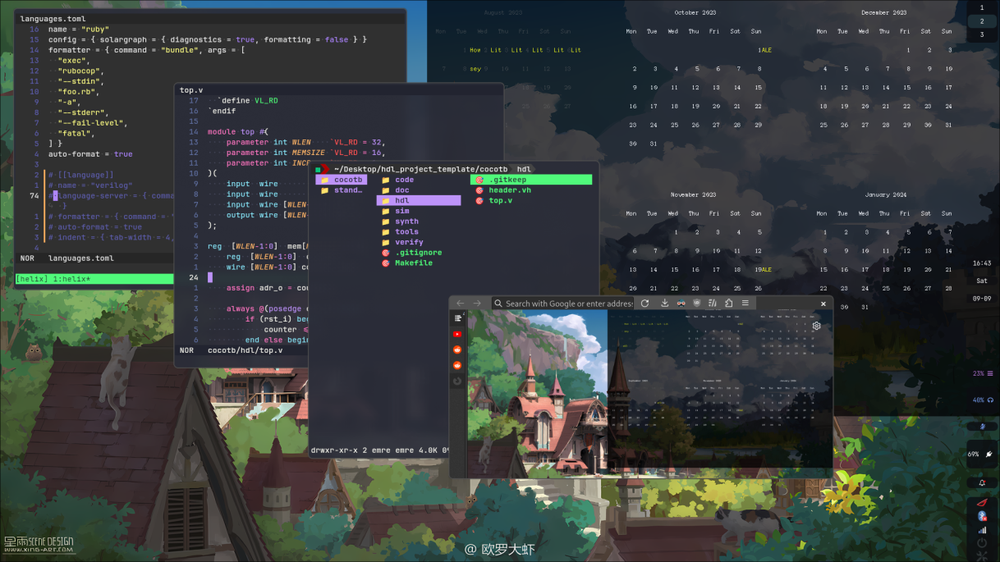

# Dotfiles

|   |   |
|---|---|
| **Distro**      | Arch btw   |
| **WM**          | Hyprland   |
| **Bar**         | Waybar     |
| **Editor**      | Helix+tmux |
| **FileManager** | LF         |
| **WP-Manager**  | swww       |

# Install
* Don't. Paths are hardcoded to my PC. I suggest just using my ./configs.
1. Use archinstall on live Arch Linux ISO and install Hyprland.
  * Use `iwctl` to connect WIFI if needed.
2. After installing arch: `git clone https://github.com/hakan-demirli/dotfiles`
3. If you need WIFI:
  * `cd dotfiles`
  * `./scripts/lin/ib.sh i_network`
  * `python ./scripts/python/unused/symlinkConfigs.py`
  * Then reboot. Waybar will appear together with network manager applet.
  * Use applet to connect to WIFI.
4. `./scripts/lin/ib.sh`
  * It will automatically reboot after the install. 
5. Auto install my [firefoxCSS](https://github.com/hakan-demirli/Firefox_Custom_CSS).
  * `python ./scripts/python/unused/installFirefoxCSS.py`
