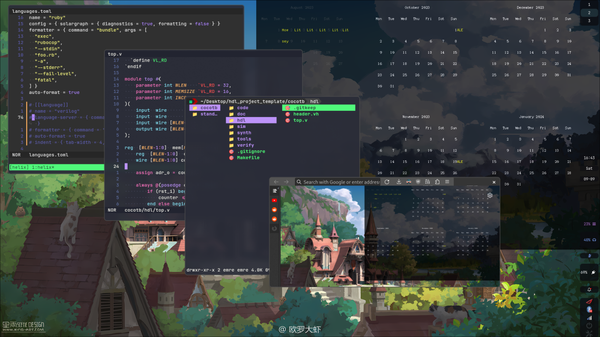

# Dotfiles



|   |   |
|---|---|
| **Distro**      | Nixos        |
| **WM**          | Hyprland     |
| **Bar**         | Waybar       |
| **Editor**      | Helix+tmux   |
| **FileManager** | lf           |
| **WP-Manager**  | swww         |
| **Keyboard**    | tbk_mini-QMK |

# Install
* ```nix-shell -p git git-crypt home-manager helix```
* If you don't have the key remove/rename git config.
  * ```mv ./.config/git/config ./.config/git/config_bckp```
* If you have the key decrypt secrets
  * ```git-crypt unlock ../git-crypt-key```
* ```sudo nixos-rebuild switch --flake ~/Desktop/dotfiles/#myNixos```
* ```home-manager switch --flake ~/Desktop/dotfiles/#emre```
